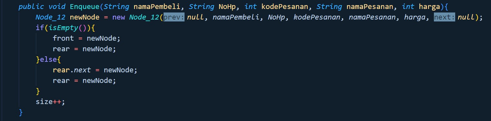
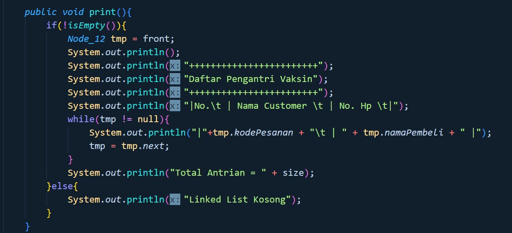

**KUIS  2 SEMESTER GENAP 2021/2022** 

Mata Kuliah : Praktikum Algoritma dan Struktur Data 

Kelas : TI  

Hari, tanggal   : Sabtu, 4 Juni 2022 

Waktu   : 08.00 WIB – 09.45 WIB. 

========= QUIZ 2 PRAKTIKUM ASD TI-1F ==========

dibuat oleh: IEMADUDDIN

NIM : 2141720055

Absen : 12

===============================================

Sistem Antrian Resto ROyal Delish

Pada sistem informasi Antrian pembeli pada resto Royal Delish yang dibuat terdapat menu – menu sebagai berikut : 

1. Tambah Antrian 

Pada saat dipilihan menu tambah antrian maka sistem akan menambahkan nomor antrian sesuai dengan urutan antrian yang ada. Kemudian sistem akan meminta inputan berupa nama pembeli, dan nomor hp. Data yang sudah diinputkan akan disimpan di linked list. 

Catatan : gunakan penambahan data melalui pembuatan object menggunakan kodeprogram  (diset di program ) untuk menghindari input data melalui keyboard yang memakan waktu. 

2. Cetak Antrian 

Menu ini akan menampilkan seluruh antrian yang ada pada linked list Contoh : 

3. Hapus Antrian 

**Hapus antrian harus sesuai dengan No antrian**. Pada menu hapus antrian artinya pembeli telah menuju kasir untuk pesan makanan. Sehingga pada menu ini harus di inputkan makanan yang dipesan oleh pembeli.  

Dan saat sukses mengembalikan maka antrian harus berkurang. Contoh dibawah ini telah ada 2 pembeli yang memesan makanan sehingga antrian tersisia 2  

4. Laporan pesanan (urut by Nama) 

Ketika semua atrian telah habis dan resto akan tutup Menu ini akan melaporkan daftar pesanan yang sudah masuk dan terurut berdasarkan nama pesanan 

5. Hitung total pendapatan 

Ketika semua atrian telah habis dan resto akan tutup maka menu total pendapatan digunakan untuk menghitung keseluruhan pendapatan dari pesanan yang sudah masuk 

